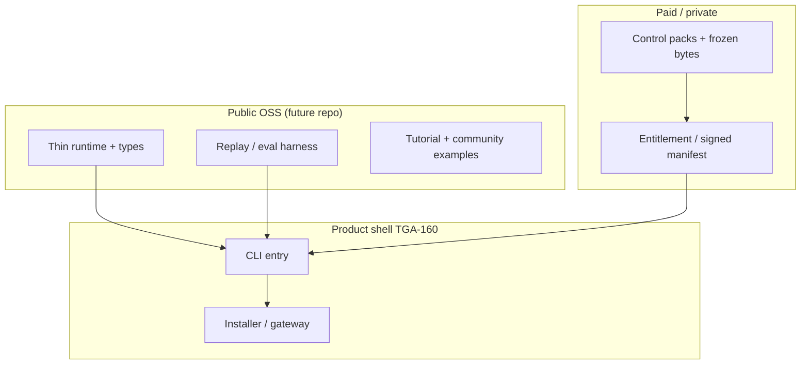

# Echelon product shell ↔ open core alignment (v0.1)

**Ticket:** [TGA-241](https://youtrack.thegig.agency/issue/TGA-241) · Epic [TGA-233](https://youtrack.thegig.agency/issue/TGA-233)  
**Partner epics / tickets (YouTrack):** [TGA-160](https://youtrack.thegig.agency/issue/TGA-160) (Echelon product shell), [TGA-165](https://youtrack.thegig.agency/issue/TGA-165), [TGA-168](https://youtrack.thegig.agency/issue/TGA-168)  
**This repo:** `agent-brain` — cognitive router, eval harness, proprietary fixtures (superset until OSS extract)

## Purpose

Prevent the **open-core split** (TGA-233, ADR-002, boundary matrix) from fighting the **product shell** work (public CLI, installer mode, gateway façade). This memo is the dependency map and extraction order both epics should reference.

## Dependency map (conceptual)

- **Product shell** should depend on **semver’d OSS packages**, not on copying `src/cognitive-router` ad hoc.
- **Proprietary fixtures** must never be compiled into the OSS artifact; the shell loads packs via **entitlement paths** only ([TGA-237](https://youtrack.thegig.agency/issue/TGA-237)).

## Conflicts to avoid

| Risk | Mitigation |
|------|------------|
| CLI bakes in `fixtures/echelon/real-replays-*` | CI denylist on shell repo + integration tests that only use `tutorial-replay` / `community-example` in OSS paths. |
| Installer ships “eval for free” with frozen thresholds | Frozen pass semantics ship **inside** paid pack or private manifest; OSS defaults stay tutorial-only. |
| Two divergent `scoreTerrain` implementations | Single npm package source of truth; shell pins semver range. |
| Gateway calls hosted `POST /route` by default | Model 2 is opt-in per [TGA-238](https://youtrack.thegig.agency/issue/TGA-238); default remains local. |

## Extraction order (agent-brain → OSS repo)

1. **Types + specs** (`types.ts`, `docs/cognitive-router/spec/**`) — stable ABI for shell.
2. **Runtime core** (`scoring`, `baselines`, `router-runner`, `trace`, `replay-dataset`, `replay-evaluator`, `benchmark-runner`, `debugging-world`) — matches `adr-002-phase1-oss-publish-scope.md` cut list.
3. **Validation helpers** (`community-pack-validation`, OSS boundary script) — keep public CI honest.
4. **Shell** (TGA-160): CLI wraps `node`/`npx` calls to published package; installer drops config + optional license path for packs.
5. **Paid packs** remain separate build pipeline ([TGA-236](https://youtrack.thegig.agency/issue/TGA-236) registry ids).

## YouTrack hygiene (acceptance for TGA-241)

Paste the following into **comments** (or epic descriptions) on **TGA-233** and **TGA-160** so cross-links survive outside this repo:

> Open core (TGA-233) and product shell (TGA-160) are aligned per `agent-brain` memo `project-brain/echelon/echelon-product-shell-alignment-v0.1.md` (TGA-241): the public CLI/installer consumes semver’d OSS packages only; proprietary replay/frozen bytes load via entitlement + registry assets (`proprietary-moat-registry-v0.1.json`); default path is local-first (Model 1), not hosted `POST /route` (Model 2). Extraction order: types/specs → runtime harness → validation → shell wiring.

## Changelog

- **v0.1** — Initial alignment memo for TGA-241.
